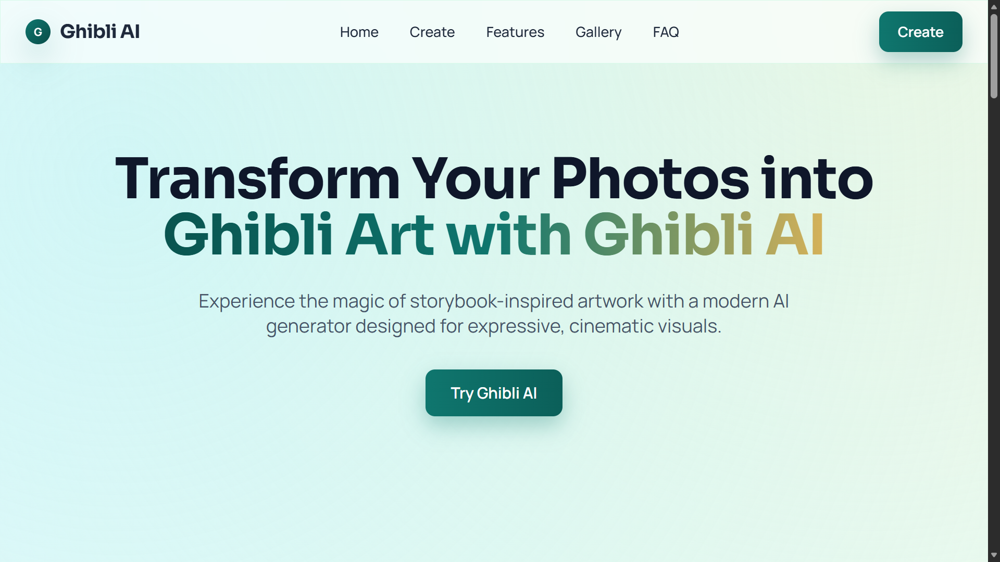
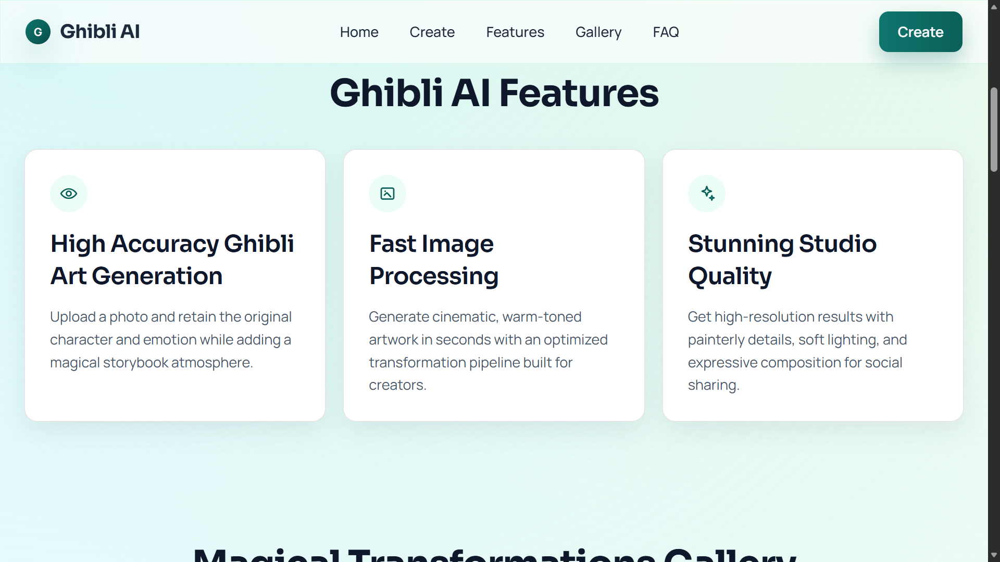
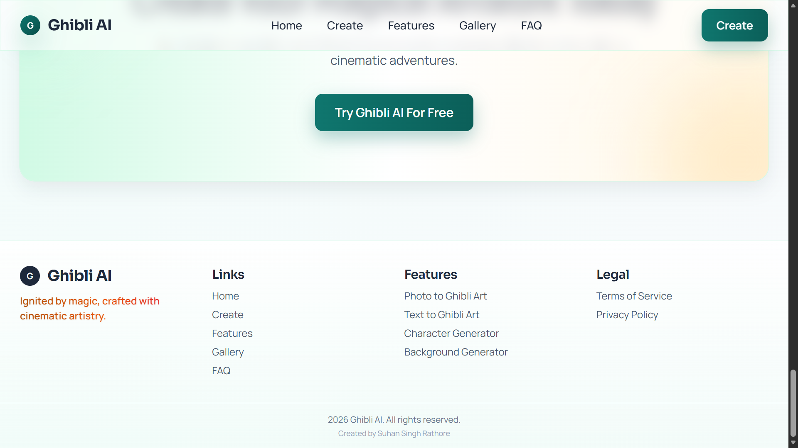
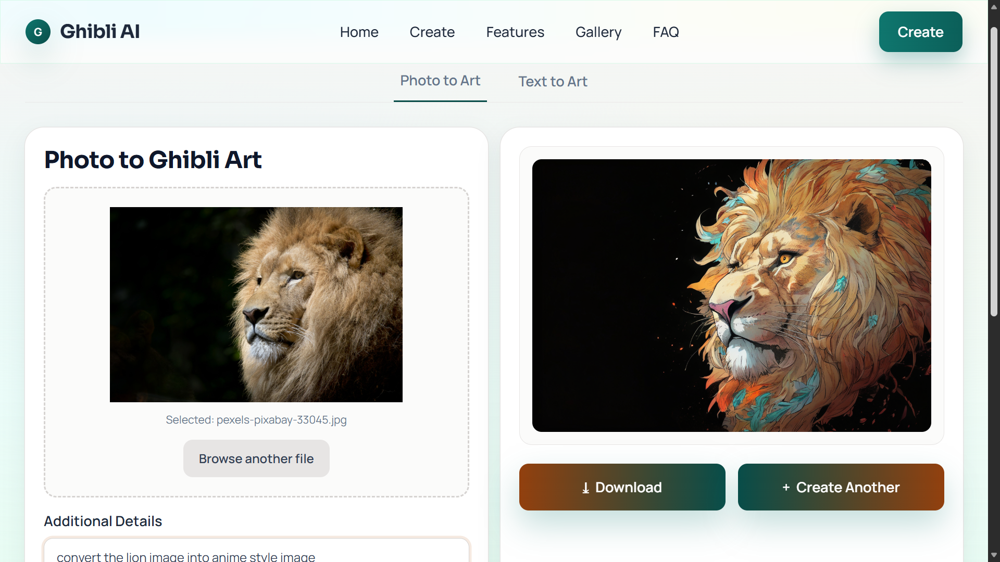
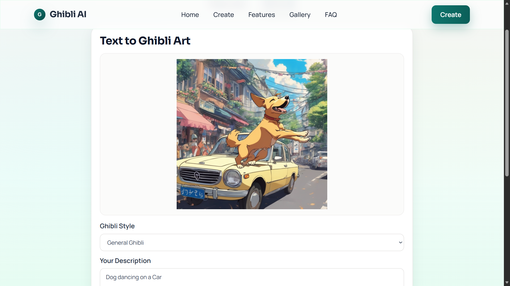

# Ghibli AI Art Generator

A full-stack web application that creates Studio Ghibli style artwork using Stability AI.

Users can:
- Upload a photo and transform it into Ghibli-style art (image-to-image)
- Enter a prompt and generate Ghibli-style art from text (text-to-image)

## Project Structure

This project has two applications:

- Frontend: `ghbli-art-generator` (React)
- Backend: `ghbliapi` (Spring Boot + OpenFeign)

## Core Features Implemented

### 1. Image-to-Image Transformation
- Users upload an image in PhotoToArt.
- Frontend sends a multipart request (`image` + `prompt`) to backend.
- Backend sends request to Stability API and returns generated image bytes.
- Frontend displays generated image with Download and Create Another actions.

### 2. Text-to-Image Generation
- Users provide a text prompt and select a style.
- Frontend sends JSON payload to backend.
- Backend maps style/prompt and calls Stability text-to-image endpoint.
- Generated image is shown in UI with smooth interaction flow.

### 3. Dynamic UI and UX
- Landing page sections: Hero, Features, Gallery, FAQ, CTA.
- Dedicated Create page with PhotoToArt and TextToArt tabs.
- Smooth scrolling navigation behavior from header/footer links.
- Compact layout updates for better screenshot-friendly composition.

### 4. Post-Generation Workflow
- Download generated image button with icon and gradient style.
- Create Another button resets form for next generation.
- Scroll-to-top behavior after generation and reset for better usability.

### 5. Reliable Upload and API Handling
- Frontend file-size validation for image uploads (5MB).
- Backend photo generation validation aligned with Stability limits.
- Improved backend error responses so frontend can show meaningful messages.
- CORS support for local frontend ports used in development.

### 6. Codebase Improvements
- Component files migrated from `.js` to `.jsx`.
- Import paths preserved so behavior remains unchanged.
- Build remains successful after migration.

## Tech Stack

### Frontend
- React
- React Router
- Tailwind CSS
- Fetch API

### Backend
- Spring Boot
- Spring Web
- Spring Cloud OpenFeign
- Maven

### External API
- Stability AI (text-to-image and image-to-image)

## API Endpoints

Base path: `http://localhost:8080/api/v1`

- `POST /generate`
	- Multipart form-data
	- Fields: `image`, `prompt`
	- Response: `image/png`

- `POST /generate-from-text`
	- JSON body
	- Fields: `prompt`, `style`
	- Response: `image/png`

## Local Setup

### Prerequisites
- Node.js 18+
- Java 21+
- Maven (or use Maven Wrapper)
- Stability API key

## 1) Start Backend

From the `ghbliapi` folder:

```bash
set STABILITY_API_KEY=your_api_key_here
./mvnw spring-boot:run
```

Windows PowerShell:

```powershell
$env:STABILITY_API_KEY="your_api_key_here"
.\mvnw.cmd spring-boot:run
```

Backend runs at:
- `http://localhost:8080`

## 2) Start Frontend

From the `ghbli-art-generator` folder:

```bash
npm install
npm start
```

Frontend runs at:
- `http://localhost:3000`

## Build

Frontend production build:

```bash
npm run build
```

Backend compile check:

```bash
.\mvnw.cmd -DskipTests compile
```

## Usage

### PhotoToArt Flow
1. Open Create page
2. Select PhotoToArt
3. Click Browse files and upload image (max 5MB)
4. Add additional details
5. Click Transform to Ghibli Art
6. Download result or click Create Another

### TextToArt Flow
1. Open Create page
2. Select TextToArt
3. Choose style
4. Enter description prompt
5. Click Generate Ghibli Art
6. Download result or click Create Another

## Notes

- If you see network errors, verify backend is running on port `8080`.
- If photo upload fails, check image size (must be 5MB or less).
- Keep `STABILITY_API_KEY` set in backend environment.

## Project Screenshots

### Screenshot 1: Home Page


### Screenshot 2: Features Section


### Screenshot 3: Footer


### Screenshot 4: PhotoToArt Generation


### Screenshot 5: TextToArt Creation


## Why This Is a Strong Portfolio Project

- Full-stack delivery from end to end:
	This project shows complete product thinking across frontend and backend, from UI interactions in React to API orchestration in Java/Spring Boot.

- Practical third-party AI integration:
	It demonstrates real-world experience integrating Stability AI, including payload design, request/response handling, error management, and user-friendly feedback.

- Modern frontend engineering:
	The application uses React Router for multi-page flows and Tailwind CSS for clean, responsive UI implementation, reflecting current production-ready frontend practices.

- Clean backend API design:
	The backend is built as a clear REST service with Spring Boot and uses Feign-based communication patterns for external service calls, aligned with maintainable service architecture principles.

- Product-quality user experience focus:
	Beyond core generation logic, the app includes polished UX details such as smooth scrolling behavior, reset/download workflows, compact responsive layouts, and validation safeguards.

## License

This project is for educational and portfolio use.
